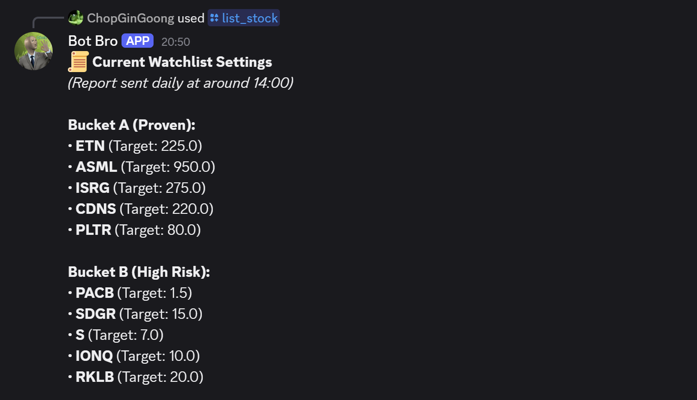
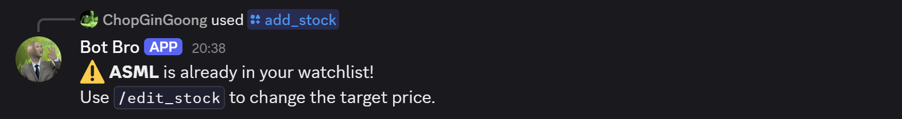
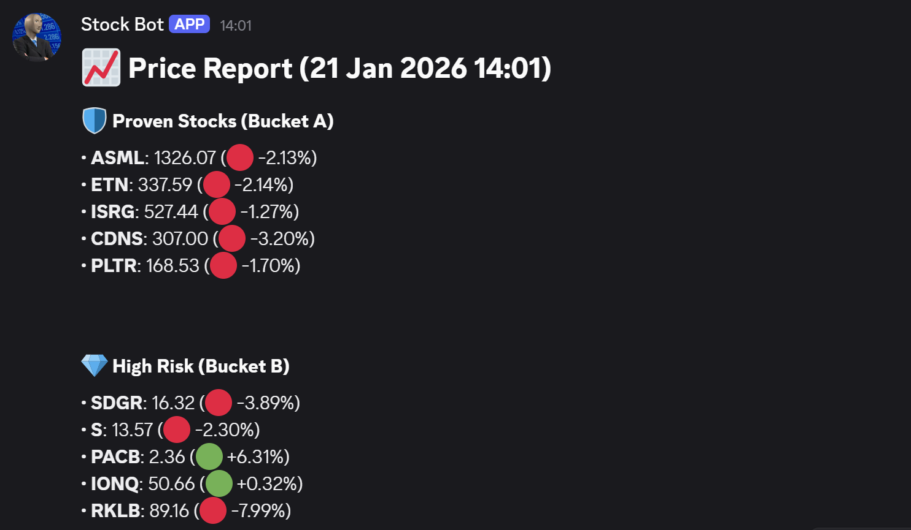
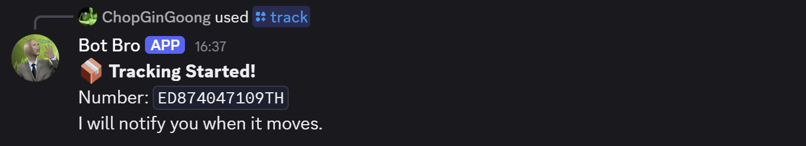
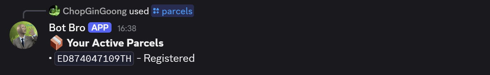
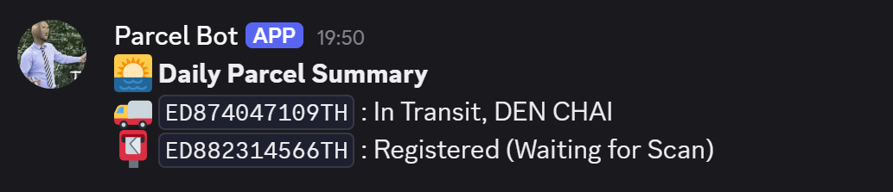

---
# 📦 Universal Discord Tracker (Stocks & Parcels)


[📘 **Read the Full Deployment Guide (Wiki)**](../../wiki)
A serverless, zero-cost Discord bot that tracks **Stock Prices** and **Parcel Shipments**. 

Built with **Python**, hosted on **Vercel** (for commands), and powered by **GitHub Actions** (for scheduled updates). It uses **Supabase** as the database memory.

---

## 🚀 Features

### 📈 Stock Tracker
* **Watchlist Management:** Add/Edit/Delete stocks directly from Discord.
* **Buckets System:** Organize stocks into "Bucket A" (Proven) and "Bucket B" (High Risk).
* **Daily Reports:** Sends a price summary every day at **2:00 PM (Thailand Time)**.
* **Buy Zone Alerts:** Instant warnings if a stock dips below your target price.

### 📦 Parcel Tracker
* **Multi-Carrier Support:** Powered by 17Track (supports Flash, Kerry, ThaiPost, J&T, etc.).
* **Real-Time Updates:** Checks status every **30 minutes**. Only pings you if the status *changes*.
* **Daily Summary:** Sends a list of all active parcels at 2:00 PM.
* **Auto-Cleaning:** Automatically deletes parcels from the database once they are marked "Delivered."

---

## 🧠 Architecture: The "Split-Brain" System

This project uses two separate brains to stay 100% free and serverless.

| Component | Service | Role |
| :--- | :--- | :--- |
| **The Listener** | **Vercel** | Wakes up only when you type a command (e.g., `/add_stock`). Updates Supabase instantly. |
| **The Watcher** | **GitHub Actions** | Wakes up on a schedule (Daily & Every 30 mins). Checks prices/parcels and sends reports. |
| **The Memory** | **Supabase** | Stores your watchlist and active tracking numbers. |

---

## 🛠️ Slash Commands

| Command | Usage | Description |
| :--- | :--- | :--- |
| `/add_stock` | `[symbol] [target] [bucket]` | Add a stock to the watchlist (e.g., `NVDA 100 A`). |
| `/edit_stock` | `[symbol] [new_target]` | Update the target buy price for a stock. |
| `/delete_stock`| `[symbol]` | Remove a stock from the watchlist. |
| `/list_stock` | n/a | View current watchlist settings instantly. |
| `/track` | `[number]` | Start tracking a parcel (e.g., `TH12345678`). |
| `/parcels` | n/a | Show your list of currently active parcels. |

---

## ⚙️ Setup & Configuration

### 1. Environment Variables (Secrets)
Both **Vercel** and **GitHub Actions** require these secrets to function.

| Key | Description | Required In |
| :--- | :--- | :--- |
| `STOCK_DISCORD_URL` | Webhook URL for the **Stock Channel**. | GitHub |
| `PARCEL_DISCORD_URL`| Webhook URL for the **Parcel Channel**. | GitHub |
| `PARCEL_TRACK_DISCORD_URL`| Webhook URL for **Parcel Alerts** (30 min updates). | GitHub |
| `SUPABASE_URL` | Your Supabase Project URL. | Vercel & GitHub |
| `SUPABASE_KEY` | Your Supabase `service_role` or `anon` key. | Vercel & GitHub |
| `TRACK17_KEY` | API Access Token from 17Track. | Vercel & GitHub |
| `DISCORD_PUBLIC_KEY` | Public Key from Discord Developer Portal. | **Vercel Only** |

### 2. Database Schema (Supabase)

**Table: `stocks`**
```sql
create table stocks (
  id bigint generated by default as identity primary key,
  symbol text not null,
  target_price decimal not null,
  bucket text not null, -- 'A' or 'B'
  created_at timestamp with time zone default now()
);

```

**Table: `parcels`**

```sql
create table parcels (
  id bigint generated by default as identity primary key,
  tracking_number text not null,
  last_status text default 'Registered',
  discord_user_id text not null,
  created_at timestamp with time zone default now()
);

```

---

## 📂 Project Structure
### Discord Tracker 
```text
├── .github/workflows/
│   ├── daily_report.yml    # Runs daily at 2 PM (Stocks + Parcel Summary)
│   └── parcel_watcher.yml  # Runs every 30 mins (Real-time updates)
├── check_stocks.py         # Script: Generates Daily Stock Report
├── check_parcels.py        # Script: Checks for parcel status changes
├── daily_parcel_report.py  # Script: Summarizes all parcels
└── README.md               # You are here

```
### Discord Listener 
```text
├── api/
│   └── index.py            # The Brain (Vercel runs this)
├── register_commands.py    # The Menu (You run this locally)
├── requirements.txt        # Dependencies
└── README.md               # Private Guide
```
---
## 📸 Appendix: Gallery

### 1. Stock Commands
**`/add_stock`** - Adding a new stock to the watchlist.


**`/list_stock`** - Viewing the current configuration (Buckets & Targets).


**`/edit_stock`** - Updating a target price without deleting.


**Error Handling** - The bot warns you if you try to add a duplicate stock.


**Daily Price Report** - The automated report sent every day at 2:00 PM.


---

### 2. Parcel Commands
**`/track`** - Registering a new tracking number.


**`/parcels`** - Checking your active shipments.


**`Real-Time Update`** - The alert you get when a parcel moves.


---

*Created for personal use. 100% Automated.*
